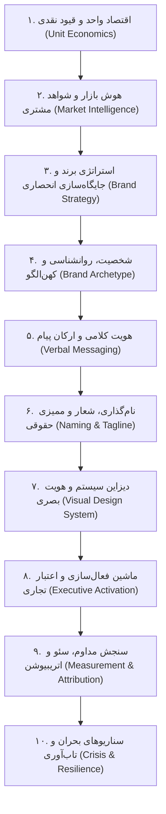
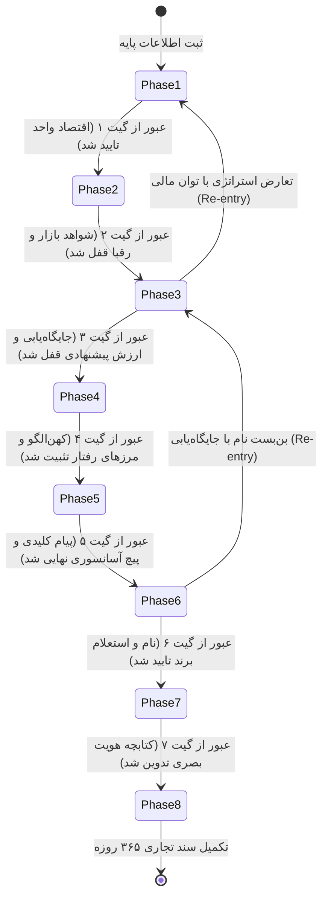
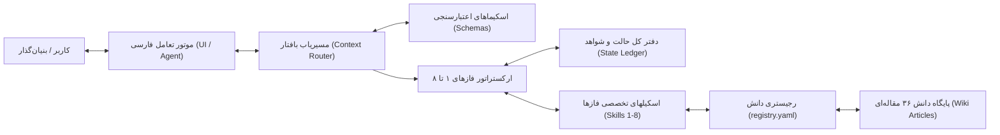
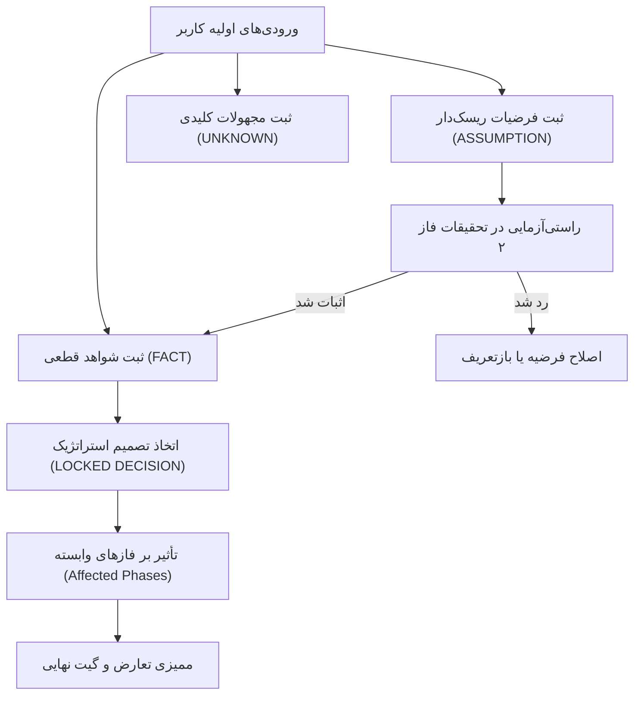

# DIGITAL MARKET v2.0 — System Architecture Specification

## ۱. خلاصه‌ی اجرایی و اصول بنیادین معماری (Executive Summary)

**DIGITAL MARKET** یک اکوسیستم جامع مبتنی بر معماری کارگزاران هوشمند (AI-Agent Architecture) است که فرآیند برندسازی تجاری، استراتژی بازار، هویت‌سازی و عملیات اجرایی را از حالت یک فرآیند ذهنی، سلیقه‌ای و متن‌محور خارج کرده و به یک سیستم مهندسی‌شده، مستند، داده‌محور و ردیابی‌پذیر تبدیل می‌کند.

### اصول محوری معماری:
1. **پایگاه دانش محوری (Knowledge-Grounded Execution)**:
   هیچ تصمیم استراتژیک، نام‌گذاری، هویت کلامی یا سیستم بصری نباید ناشی از توهم (Hallucination) مدل‌های زبانی باشد؛ تمامی خروجی‌ها به ۳۶ مقاله مرجع و ۱۶۵ منبع علمی و میدانی گره خورده‌اند.
2. **عدم تقلیل بافتار (Non-Reductionist Context Specialization)**:
   کسب‌وکارها در قالب یک منوی کشویی ساده (مانند خرده‌فروشی یا خدماتی) دسته‌بندی نمی‌شوند. بافتار از ترکیب ۱۵ بعد مستقل ریاضی و بیزنسی بازتولید شده و اورلی‌های عملیاتی را فعال می‌کند.
3. **گیت‌های سخت‌گیرانه فازها (Strict Phase Gates & No-Skip Policy)**:
   سیستم به صورت مطلق اجازه تصمیم‌گیری زودهنگام (مانند تعیین نام، لوگو یا رنگ قبل از تصویب اقتصاد واحد و پرسونای مخاطب) را نمی‌دهد.
4. **ردیابی‌پذیری و دفتر کل شواهد (State & Evidence Ledger)**:
   هر تصمیم باید به شواهد عینی، داده‌های راستی‌آزمایی‌شده یا فرضیات ریسک‌سنجی‌شده متصل باشد. اگر یک تصمیم جدید با داده‌های فازهای قبل تعارض پیدا کند، سیستم پروتکل بازگشت به فاز قبلی (Re-entry) را فعال می‌کند.
5. **ارتباط روان و محترمانه به زبان فارسی (Dignified Persian Engine)**:
   تمامی تعاملات سمت کاربر با زبان فارسی دقیق، فاخر، بدون اصطلاحات گیج‌کننده انگلیسی و متناسب با فرهنگ بازار ایران هدایت می‌شود.

---

## ۲. زنجیره ۱۰ حلقه‌ای تصمیمات بیزنس و برند (The 10-Link Decision Chain)

در ساختار DIGITAL MARKET، فرآیند ساخت برند در ۱۰ حلقه پیوسته مدل‌سازی شده است. شکست در هر حلقه، خروجی حلقه‌های بعدی را باطل می‌کند:

---

## ۳. مسیریاب بافتار کسب‌وکار و لایه انطباق تخصصی (Business Context Router)

مسیریاب بافتار کسب‌وکار (`digital-market-business-context-router`) در آغاز فرآیند، بافتار را در ۱۵ محور متعامد استخراج می‌کند:

| شماره | محور تخصصی (Axis) | مقادیر نمونه | تأثیر بر فرآیند و سوالات |
|:---|:---|:---|:---|
| ۱ | `primary_business_model` | B2B, B2C, D2C, B2B2C, Marketplace, SaaS | شیوه ارزش‌آفرینی و نوع مشتری طرف حساب |
| ۲ | `channel_mix` | Pure Physical, Omnichannel, Digital Direct, B2B Direct | تمرکز بر لوکیشن فیزیکی یا سئو و پرفورمنس آنلاین |
| ۳ | `business_stage` | Concept, Pre-revenue, Scaling, Established Turnaround | میزان ریسک‌پذیری، بودجه و افق زمانی اقدامات |
| ۴ | `ticket_size_risk` | Low Ticket Habitual, High Ticket Considered, Enterprise Complex | طول چرخه فروش و سطح نیاز به اعتماد فنی |
| ۵ | `market_geography` | Hyper-local, Regional, National, Export International | محدوده تبلیغات و زبان برند |
| ۶ | `category_sector` | Hospitality, Tech, Industrial Manufacturing, Beauty, Healthcare | اصطلاحات صنفی، استانداردهای بهداشتی یا صنعتی |
| ۷ | `regulatory_environment` | Heavy License, Healthcare Med, Standard Commercial, Low | الزامات نماد اعتماد، سیب سلامت، پروانه‌های دولتی |
| ۸ | `operational_footprint` | Single Unit, Multi-branch, Factory, Pure Remote Cloud | مقتضیات فیزیکی تابلوسازی، یونیفرم و معماری فضا |
| ۹ | `asset_intensity` | Asset Light, Heavy Machinery, Inventory Heavy | نیاز به سرمایه در گردش و کشش تخفیف |
| ۱۰ | `margin_structure` | Thin (<15%), Medium (15-40%), High Gross (>70%) | امکان مانور روی هدایا، باشگاه مشتریان یا تبلیغات |
| ۱۱ | `founder_visibility` | Founder-led Face, Behind Scenes, Institutional Corporate | فعال‌سازی یا غیرفعال‌سازی لایه پرسونال برندینگ |
| ۱۲ | `tech_dependency` | Pure Manual, Consumer Basic, Custom Core Proprietary | پیچیدگی ابزارهای ارتباطی و اتوماسیون مارکتینگ |
| ۱۳ | `competition_density` | Monopolistic Blue Ocean, Moderate, Cut-throat Red Ocean | ضرورت تمایز حاد (Sharp Differentiation) |
| ۱۴ | `cultural_community_affinity`| High Cultural Symbolism, Functional Utility, Subculture | پیوند با آیین‌ها، مناسبت‌ها یا ادبیات محلی |
| ۱۵ | `scalability_bottleneck` | Time Labor Bound, Capital Bound, Inventory Bound, Near Infinite | ظرفیت واقعی پذیرش مشتری جدید بدون افت کیفیت |

### ترکیب اورلی‌ها (Composable Overlays):
به جای طراحی صدها اسکیل مجزا، سیستم مجموعه‌ای از اورلی‌ها را به صورت افزونه ترکیب می‌کند:
- **Local / Physical Overlay**: فعال‌سازی سوالات مربوط به پاخور، تابلو، پارکینگ، گوگل مپ و بازاریابی محلی.
- **B2B / Industrial Overlay**: تمرکز بر کمیسیون‌های خرید سازمانی، بروشورهای فنی، تاییدیه‌ها و لینکدین.
- **SaaS / Tech Overlay**: تمرکز بر مدل اشتراکی، نرخ تبدیل لندینگ پیج، زمان رسیدن به ارزش (TTV) و چِرن.
- **Founder Brand Overlay**: تدوین استراتژی تات‌لیدرشیپ، پادکست، روابط عمومی و شبکه ارتباطی ۱۰۰ نفره مدیرعامل.

---

## ۴. ارکستراتور مادر و ماشین حالت ۸ فاز (Master Workflow Orchestration)

ارکستراتور گردش کار (`digital-market-brand-building-orchestrator`) فرآیند را از طریق ۸ گیت متوالی هدایت می‌کند:

### پروتکل بازگشت به فاز قبلی (Re-entry Protocol):
اگر در فازی بعدی مشخص شود که فرضیه‌ای غلط بوده (مثلاً نام انتخابی در فاز ۶ با استعلام ثبت علائم تجاری رد شود، یا هویت کلامی فاز ۵ نیازمند سرمایه‌گذاری خارج از کشش مالی فاز ۱ باشد)، سیستم وضعیت تصمیم را به `CONTRADICTED` تغییر داده و پروژه را برای اصلاح به فاز مربوطه بازمی‌گرداند.

---

## ۵. ساختار داده و دفتر کل شواهد (State & Evidence Ledger)

اطلاعات پروژه در فایل ساختاریافته `project-state.json` و مطابق با `schemas/project-state.schema.json` ذخیره می‌شود:

### رده‌بندی شواهد:
1. **FACT**: داده‌های قطعی اثبات‌شده میدانی، مالی یا اسنادی (دارای منبع و زمان).
2. **DECISION**: انتخاب‌های رسمی تصویب‌شده کاربر در جلسات استراتژی (وضعیت: `PROPOSED`, `LOCKED`, `SUPERSEDED`, `CONTRADICTED`).
3. **ASSUMPTION**: حدسیات اولیه که صحت آن‌ها هنوز بررسی نشده و دارای برچسب سطح ریسک و فاز هدف برای راستی‌آزمایی هستند.
4. **UNKNOWN**: مجهولات صریح در بازار یا محصول با تعیین استراتژی کشف داده.
5. **CONTRADICTION**: تعارضات شناسایی‌شده میان دو فاز که مانع عبور از گیت می‌شوند.

---

## ۶. یکپارچگی با پایگاه دانش (Knowledge Wiki & Registry)

پایگاه دانش سیستم شامل ۳۶ مقاله مرجع در دایرکتوری `wiki/` است. کلیه مفاهیم دارای شناسه‌های یکتا و پایدار با پیشوند `KB-` هستند:
- ارجاع سریع از طریق `wiki/registry.yaml` که شناسه‌ها، مقالات، فازها و نوع سوالات را نگاشت می‌کند.
- جستجوی چندگامی و ارتباطی بر اساس منطق GraphRAG.
- هر مقاله شامل ۱۴ بخش استاندارد شامل تعریف به زبان ساده، مبانی نظری، خطاهای رایج، چک‌لیست و سوالات بافتارمحور است.

---

## ۷. موتور تعاملی زبان فارسی (Persian Customer Interaction)

سیستم از الگوریتم تبدیل مفاهیم پیچیده به پرسش‌های صمیمی و ملموس استفاده می‌کند:
- **برای کارواش و تعویض روغنی**: گفتگو درباره میزان رضایت رانندگان از معطلی، شفافیت فاکتور، نظافت قطعات، و تفاوت روغن تقلبی با اصلی.
- **برای کافی‌شاپ**: گفتگو درباره تکرار خرید مشتریان محله، عطر قهوه تازه، رفتار پرسنل پشت بار و پاتوق‌سازی.
- **برای B2B SaaS**: گفتگو درباره چالش‌های مدیران مالی با نرم‌افزارهای سنتی، نرخ ریزش اشتراک و امنیت سرورها.
- **برای کارخانجات تولیدی**: گفتگو درباره ظرفیت خالی خط تولید، تلورانس ابعادی قطعات و تضمین تحویل به‌موقع در قراردادهای پیمانکاری.

---

## ۸. نمودارهای معماری (Architecture Diagrams)

### دیاگرام جامع جریان داده و اجزای سیستم:

### دیاگرام جریان شواهد و ردیابی تصمیمات:

