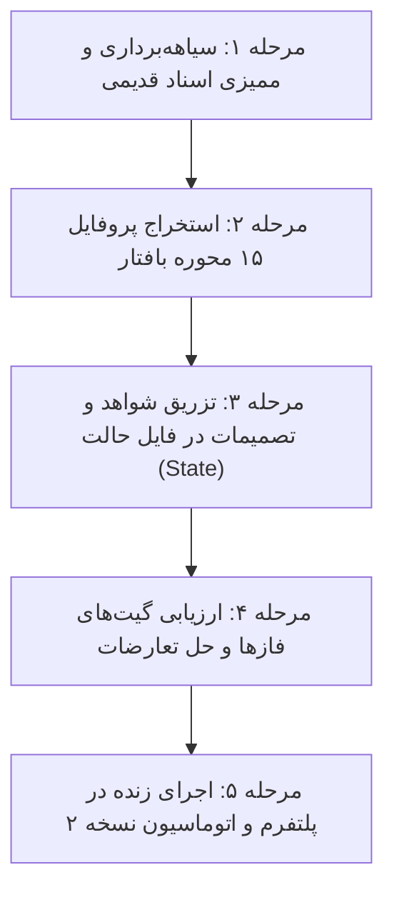

# DIGITAL MARKET — Migration Plan: Legacy to v2.0 Architecture

## ۱. اهداف و چشم‌انداز مهاجرت

هدف از این طرح، هدایت فرآیند انتقال پروژه‌ها، پرامپت‌ها و داده‌های سیستم قدیمی DIGITAL MARKET به معماری مدرن، ماژولار و مبتنی بر پایگاه دانش **نسخه ۲.۰** است. با اجرای این برنامه:
1. داده‌های پروژه‌های جاری بدون از دست رفتن اطلاعات به فرمت استاندارد `project-state.json` تبدیل می‌شوند.
2. ابعاد کسب‌وکار در ساختار ۱۵ محوره بافتار ثبت می‌گردند.
3. تصمیمات اتخاذشده در گذشته به دفتر کل شواهد با شناسه‌های معتبر متصل می‌شوند.

---

## ۲. مراحل پنج‌گانه مهاجرت عملیاتی (Phased Rollout)



### مرحله ۱: سیاهه‌برداری و ممیزی اسناد قدیمی (Inventory & Assessment)
- کلیه یادداشت‌ها، بریف‌ها، خروجی‌های گفتگوی قبلی و فایل‌های متنی پروژه را جمع‌آوری کنید.
- اطلاعات را به ۴ دسته اولیه تفکیک کنید:
  - ادعاهای مالی و عملیاتی (نامزد تبدیل به `FACT`)
  - تصمیمات قطعی اتخاذشده درباره برند (نامزد تبدیل به `DECISION`)
  - فرضیات اثبات‌نشده درباره مشتری و بازار (نامزد تبدیل به `ASSUMPTION`)
  - سوالات باز و ابهامات حل‌نشده (نامزد تبدیل به `UNKNOWN`)

### مرحله ۲: استخراج پروفایل ۱۵ محوره بافتار (Context Profile Extraction)
- یک شیء مطابق با `schemas/business-context.schema.json` بسازید و مقادیر ۱۵ گانه را تعیین کنید.
- نمونه:
```json
{
  "primary_business_model": "b2c_physical_retail",
  "channel_mix": "pure_physical",
  "business_stage": "scaling_growth",
  "ticket_size_risk": "low_ticket_habitual",
  "market_geography": "hyper_local",
  "category_sector": "beauty_wellness",
  "regulatory_environment": "standard_commercial",
  "operational_footprint": "single_location",
  "asset_intensity": "inventory_heavy",
  "margin_structure": "medium_margin",
  "founder_visibility": "discreet_internal",
  "tech_dependency": "tech_consumer_basic",
  "competition_density": "high_local_density",
  "cultural_community_affinity": "high_cultural_symbolism",
  "scalability_bottleneck": "geography_linear"
}
```

### مرحله ۳: مقداردهی اولیه به فایل حالت پروژه (State Hydration)
- یک فایل جدید بر اساس `state/project-state.template.json` ایجاد کنید.
- فکت‌ها، تصمیمات قفل‌شده، فرضیات و مجهولات را با شناسه‌های استاندارد وارد کنید.
- به هر تصمیم، شواهد پشتیبان (`evidence_refs`) و شناسه‌های مرتبط در پایگاه دانش (`knowledge_refs`) را اضافه نمایید.

### مرحله ۴: ارزیابی گیت‌های فاز و شناسایی تعارضات (Gate Audit)
- بالاترین فازی که پروژه قبلاً در آن متوقف شده بود را ارزیابی کنید.
- آیا گیت‌های خروج فازهای قبلی پاس شده‌اند؟
  - اگر فاز ۳ (استراتژی) تصمیم‌گیری شده اما داده مالی فاز ۱ ثبت نشده باشد، وضعیت تصمیم را `PROPOSED` نگه دارید تا داده مالی شفاف شود.
  - اگر تعارضی وجود دارد، آن را در آرایه `contradictions` با وضعیت `OPEN` ثبت کنید.

### مرحله ۵: اجرای عملیاتی تحت نسخه ۲ (Production Operation)
- پروژه را در پلتفرم وب یا توسط ارکستراتور بارگذاری کنید.
- سیستم از این پس با سوالات متناسب با بافتار، کاربر را به سمت فاز ۸ و خروجی تجاری هدایت خواهد کرد.

---

## ۳. چک‌لیست اطمینان از مهاجرت موفق (Migration Checklist)
- [ ] فایل `project-state.json` پروژه با اسکیما اعتبارسنجی شده است.
- [ ] تمام ۱۵ بعد بافتار تکمیل شده و اورلی‌های مربوطه فعال شده‌اند.
- [ ] کلیه تصمیمات ثبت‌شده دارای رفرنس به شواهد یا پایگاه دانش هستند.
- [ ] هیچ فرضیه پرریسکی بدون برنامه اعتبارسنجی در فازهای بعدی رها نشده است.
- [ ] اسکریپت `python scripts/validate_system.py` با موفقیت اجرا می‌شود.
