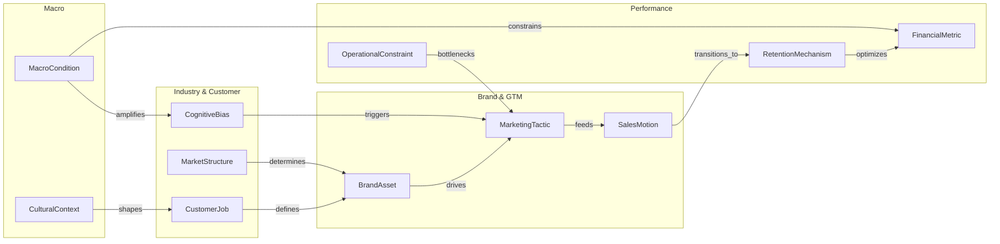

# هستی‌شناسی هسته‌ای و نگاشت ارتباطات چندبعدی GraphRAG
## GraphRAG Ontology & Multi-Hop Cross-Domain Knowledge Graph

---

### ۱. معماری هستی‌شناسی (Ontology Architecture)

در سیستم‌های سنتی RAG، بازیابی مبتنی بر تشابه برداری (Vector Similarity) صرفاً تکه‌های متنی جداگانه را می‌یابد و قادر به درک ارتباطات زنجیره‌ای، روابط علی و معلولی، و تضادهای پنهان میان دامنه‌های مختلف نیست.

هستی‌شناسی **GraphRAG تخصصی تصمیم‌گیری کسب‌وکار** دانش را در قالب موجودیت‌ها (Entities) و یال‌های معنایی جهت‌دار (Directed Semantic Edges) مدل‌سازی می‌کند تا هوش مصنوعی بتواند در طول زنجیره **۱۰ مرحله‌ای** حرکت کرده و تصمیمات ترکیبی اتخاذ نماید:

$$\text{جامعه} \longrightarrow \text{اقتصاد} \longrightarrow \text{بازار} \longrightarrow \text{مشتری} \longrightarrow \text{برند} \longrightarrow \text{بازاریابی} \longrightarrow \text{فروش} \longrightarrow \text{CRM} \longrightarrow \text{مدیریت} \longrightarrow \text{مالی/عملیات}$$



---

### ۲. تیپولوژی گره‌ها (Entity Node Types)

| کد موجودیت | نام دسته گره | توضیحات و حوزه‌های شمول | نمونه مقادیر در گراف |
| :--- | :--- | :--- | :--- |
| `ENT_MACRO` | `MacroCondition` | وضعیت اقتصاد کلان، ارز، تورم و نرخ بهره | `High_Inflation_40%`, `Currency_Devaluation`, `Stagflation` |
| `ENT_CULT` | `CulturalContext` | کدهای فرهنگی، هنجارهای جمعی و سرمایه نمادین | `High_Uncertainty_Avoidance`, `Collectivism`, `Status_Seeking` |
| `ENT_MKT` | `MarketStructure` | ساختار صنعت، شدت رقابت و موانع ورود | `Porter_High_Barriers`, `Low_End_Disruption_Vulnerability` |
| `ENT_JOB` | `CustomerJob` | شغل‌ها، کشمکش‌ها و رنج‌های عملکردی/احساسی مشتری | `Avoid_Financial_Loss`, `Signal_Professional_Competence` |
| `ENT_BIAS` | `CognitiveBias` | سوگیری‌های شناختی و میانبرهای ذهنی سیستم ۱ | `Loss_Aversion_2x`, `Default_Effect`, `Anchoring_Heuristic` |
| `ENT_BRAND` | `BrandAsset` | دارایی‌های برند، موقعیت‌یابی، تمایز و ادراک | `Distinctive_Visual_Code`, `Mental_Availability_Cues`, `CBBE_Pyramid` |
| `ENT_MKTG` | `MarketingTactic` | کمپین‌ها، ابزارهای آمیخته، کانال‌ها و پیام‌ها | `Price_Unbundling`, `Loss_Framed_Copy`, `Omnichannel_Reach` |
| `ENT_SALES` | `SalesMotion` | فرآیندهای فروش، متدولوژی جلسات و بستن قرارداد | `SPIN_Implication_Probing`, `Challenger_Commercial_Teaching` |
| `ENT_RET` | `RetentionMechanism` | موتورهای نگه‌داشت، آنبوردینگ، کاهش ریزش و وفاداری | `Frictionless_Onboarding`, `Super_Consumer_VIP`, `NPS_Survey` |
| `ENT_OPS` | `OperationalConstraint` | محدودیت‌های فیزیکی، ظرفیت لجستیک و پرسنل | `Goldratt_Fulfillment_Bottleneck`, `Support_Team_Capacity` |
| `ENT_FIN` | `FinancialMetric` | سنجه‌های سلامت مالی، حاشیه سود و اقتصاد واحد | `CAC_Payback_9M`, `LTV_CAC_3x`, `Gross_Margin_65%` |

---

### ۳. معناشناسی روابط و یال‌ها (Edge Semantics)

1. `CONSTRAINS` (محدود می‌کند): موجودیت مبدا سقف عملکردی یا آزادی عمل موجودیت مقصد را تعیین می‌کند (مثلاً تورم کلان، استراتژی قیمت‌گذاری را مقید می‌کند).
2. `AMPLIFIES` (تشدید می‌کند): پدیدار شدن یک عامل، شدت یا تاثیر عامل دیگر را چندبرابر می‌سازد (مثلاً بحران اقتصادی، سوگیری زیان‌گریزی مشتری را تشدید می‌کند).
3. `VALIDATES` (اعتبارسنجی می‌کند): شواهد یک گره صحت فرضیات گره دیگر را اثبات یا رد می‌نماید (مثلاً داده‌های فروش آزمایشی، بیانیه شغل مشتری را اعتبارسنجی می‌کند).
4. `TRIGGERS` (فعال‌سازی می‌کند): وقوع یک رویداد، واکنش خودکار در سیستم دیگری ایجاد می‌کند (مثلاً فعال‌سازی لنگراندازی قیمتی، انگیزه اقدام سیستم ۱ را تحریک می‌نماید).
5. `MITIGATES` (خنثی یا مهار می‌کند): اثر منفی یک فاکتور را کاهش می‌دهد (مثلاً ساختار گارانتی بازگشت وجه، ترس ناشی از اجتناب از عدم‌قطعیت را مهار می‌کند).
6. `BOTTLENECKS` (گلوگاه ایجاد می‌کند): بر اساس تئوری محدودیت‌ها، ظرفیت مقصد را قفل می‌کند (مثلاً ظرفیت محدود تیم تحویل کالا، سقف اثربخشی کمپین جذب بازاریابی را قفل می‌کند).
7. `DRIVES_PROFITABILITY` (سودآوری را به حرکت درمی‌آورد): مستقیماً اقتصاد واحد و جریان نقدینگی را ارتقا می‌دهد (مثلاً افزایش ۵٪ نرخ نگه‌داشت، حاشیه سود خالص را بیشینه می‌سازد).

---

### ۴. مسیرهای پیمایش چندمرحله‌ای (Multi-Hop Traversal Paths)

هوش مصنوعی در هنگام مواجهه با مسئله کاربر، نباید تنها در یک گره متوقف شود؛ بلکه باید این زنجیره‌ها را طی کند:

#### سناریوی الف: زنجیره انطباق با تورم و افت قدرت خرید (Inflationary Survival Chain)
```
[Macro: High_Inflation] 
   └──(AMPLIFIES)──> [Bias: Severe_Loss_Aversion]
   └──(CONSTRAINS)──> [CustomerJob: Stretch_Household_Budget]
   └──(INVALIDATES)──> [MarketingTactic: High_Ticket_Annual_Prepay]
   └──(MANDATES)──> [MarketingTactic: Micro_Installments_BNPL + Unbundled_Offering]
   └──(CALLS_FOR)──> [SalesMotion: SPIN_Implication_Quantified_ROI]
   └──(PROTECTS)──> [FinancialMetric: Cash_Flow_Velocity & Churn_Under_3%]
```
* **تفسیر استراتژیک:** در شرایط تورم حاد، اصرار بر بسته‌های سالانه گران‌قیمت محکوم به شکست است؛ سیستم باید فوراً گزینه پرداخت خرد اعتباری (BNPL) با ارزش تفکیک‌شده پیشنهاد دهد تا چرخه نقدینگی بدون ریزش حفظ شود.

#### سناریوی ب: زنجیره تمایز پرمیوم در بخش فرهنگ‌محور (Bourdieu Cultural Capital Chain)
```
[Culture: High_Cultural_Capital]
   └──(SHAPES)──> [CustomerJob: Signal_Distinct_Taste & Subtlety]
   └──(CONSTRAINS)──> [BrandAsset: Subtle_Codes & Understated_Elegance]
   └──(VETOES)──> [MarketingTactic: Loud_Discount_Promotions]
   └──(DRIVES)──> [MarketingTactic: Exclusive_Educational_Salons]
   └──(ENABLES)──> [SalesMotion: Challenger_Insight_Teaching]
   └──(YIELDS)──> [FinancialMetric: High_Gross_Margin_80% + Price_Inelasticity]
```
* **تفسیر استراتژیک:** وقتی مخاطب هدف دارای سرمایه فرهنگی بالاست، تخفیف‌های پر سر و صدا برند را نابود می‌کند. استراتژی باید بر سیگنال‌های ظریف نمادین و فروش مبتنی بر بینش متمرکز شود تا حاشیه سود بالا تثبیت گردد.

#### سناریوی ج: توازن عملیات-بازاریابی در شرایط رشد سریع (Goldratt-Growth Chain)
```
[MarketingTactic: Aggressive_Paid_Ad_Blitz]
   └──(FLOODS)──> [Operations: Customer_Support_Capacity]
   └──(CREATES)──> [OperationalConstraint: Fulfillment_Delays_3X]
   └──(AMPLIFIES)──> [CustomerJob: Frustration_Unmet_Expectations]
   └──(TRIGGERS)──> [RetentionMechanism: Churn_Spike_to_15%]
   └──(COLLAPSES)──> [FinancialMetric: LTV_CAC_Below_1.0]
```
* **تفسیر استراتژیک:** افزایش بودجه تبلیغات بدون رفع محدودیت‌های زنجیره تامین یا پشتیبانی، نسبت LTV/CAC را به زیر ۱ می‌رساند و فاجعه مالی ایجاد می‌کند.

---

### ۵. پروتکل کوئری‌های GraphRAG برای مدل هوش مصنوعی (Graph Retrieval Schema)

هنگام تولید پاسخ یا پیشنهاد استراتژیک به کاربر، هوش مصنوعی باید خروجی خود را از فیلتر سه‌مرحله‌ای زیر عبور دهد:

1. **مرحله ۱ - شناسایی بستر (Context Identification):**
   * تعیین موقعیت اقتصاد کلان (MacroCondition)
   * تعیین وضعیت ساختار رقابت (MarketStructure)
   * استخراج کشمکش‌های واقعی مشتری (CustomerJob و CognitiveBias)

2. **مرحله ۲ - پیمایش چندمرحله‌ای لایه‌ها (Cross-Layer Traversal):**
   * انتخاب دارایی‌های ادراکی و تمایز برند (BrandAsset)
   * گزینش تاکتیک‌های بازاریابی و فروش هماهنگ (MarketingTactic و SalesMotion)
   * راستی‌آزمایی با گلوگاه‌های اجرایی (OperationalConstraint)

3. **مرحله ۳ - اعمال وتو و کنترل نهایی انسجام (Veto & Coherence Check):**
   * چک کردن عدم وجود تضاد در یال‌ها (CONTRADICTS یا VIOLATES)
   * محاسبه اقتصاد واحد (دوره بازگشت هزینه جذب کمتر از ۱۲ ماه و نسبت LTV/CAC بزرگتر مساوی ۳)
   * خروج از فیلتر و ارائه راهکار تضمین‌شده به کاربر.
