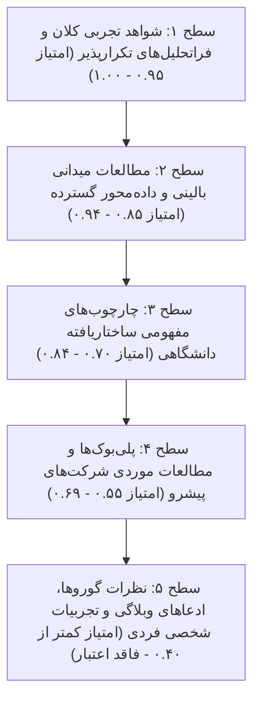

# سیستم حل تعارض، وزن‌دهی به شواهد و غربالگری ادعاها
## Conflict Resolution, Authority Scoring & Evidence Hierarchy

---

### ۱. سلسله‌مراتب معرفت‌شناختی شواهد (The Epistemological Evidence Ladder)

برای جلوگیری از ارائه راهکارهای سمی یا توصیه‌های مبتنی بر مد روز (Fads) و کتاب‌های سطحی فرودگاهی، سیستم هوش مصنوعی باید هر ادعا، نظریه و چارچوب را بر اساس مقیاس اعتبار زیر وزن‌دهی کند:

| سطح (Tier) | نوع منبع و ماهیت شواهد | منابع شاخص | امتیاز اعتبار (0-1) | قاعده حاکم بر سیستم هوش مصنوعی |
| :--- | :--- | :--- | :--- | :--- |
| **Tier 1** | شواهد تجربی تکرارپذیر در مقیاس جهانی، فراتحلیل‌ها و تئوری‌های ریاضی اثبات‌شده | Byron Sharp (Ehrenberg-Bass), Kahneman & Tversky, Mankiw, Varian | **0.95 - 1.00** | **قانون حاکم:** هرگز توسط ادعاهای سطوح پایین نقض نمی‌شود. وتوکننده تصمیمات فانتزی. |
| **Tier 2** | مطالعات میدانی و بررسی داده‌های واقعی هزاران معامله تجاری در بازارهای مختلف | Neil Rackham (SPIN), Matthew Dixon (Challenger Sale), Fred Reichheld (Bain NPS) | **0.85 - 0.94** | **پایه‌گذار روش اجرا:** دستورالعمل استاندارد برای فرآیندهای فروش و رضایت مشتری. |
| **Tier 3** | مدل‌های مفهومی معتبر دانشگاهی و استراتژیک تست‌شده در طول دهه‌ها | Michael Porter, Kevin Lane Keller, David Aaker, Clayton Christensen (JTBD) | **0.70 - 0.84** | **قالب‌بند استراتژیک:** چارچوب‌بندی جهت‌گیری‌ها، معماری هویت و موقعیت‌یابی. |
| **Tier 4** | پلی‌بوک‌های اجرایی و چارچوب‌های مستند استارتاپ‌ها و مدیران ارشد عملیاتی | Andy Grove (OKR), Rob Fitzpatrick (Mom Test), David Skok (Unit Economics) | **0.55 - 0.69** | **راهنمای تاکتیکی:** چک‌لیست‌ها و شاخص‌های روزمره اجرایی در شرایط خاص. |
| **Tier 5** | مقالات وبلاگی سلیقه‌ای، پست‌های شبکه‌های اجتماعی، پادکست‌های انگیزشی و سخنرانی‌های TED | توصیه‌های بدون منبع، ادعاهای «راز موفقیت من»، نسخه‌های عمومی موفقیت | **کمتر از 0.40** | **ممنوعیت مطلق:** سیستم مجاز نیست بر اساس این منابع به کاربر پیشنهاد بدهد. |

---

### ۲. حل و فصل تعارضات کلاسیک در مدیریت و بازاریابی (Resolving Classic Battles)

#### تعارض ۱: بایرون شارپ در برابر فیلیپ کاتلر و کوین لین کلر (تمایز مفهومی در برابر تمایز ادراکی)
* **صورت تعارض:** کاتلر و کلر بر سگمنتیشن دقیق، هدف‌گیری گوشه‌ای و تمایز عمیق ادراکی (Differentiation) و وفاداری اصرار دارند. شارپ با داده‌های تجربی نشان می‌دهد که مشتریان برندهای رقیب تفاوت شخصیتی چندانی ندارند و رشد در نفوذ گسترده و تمایز ظاهری دارایی‌ها (Distinctiveness) است نه تمایز مفهومی.
* **قاعده تفکیک سیستم هوش مصنوعی:**
  1. در محصولات مصرفی پرگردش (FMCG) و بازارهای انبوه: **دیدگاه شارپ برنده مطلق است.** تمایز دارایی‌های حسی (رنگ، بسته‌بندی، لوگو) و در دسترس بودن ذهنی و فیزیکی اولویت اول است.
  2. در بازارهای تخصصی B2B، خدمات پیچیده و محصولات پرمیوم مبتنی بر اعتماد: **دیدگاه کاتلر و کلر حاکم است.** اینجا نقاط تمایز کارکردی و استراتژی STP اهمیت حیاتی دارد.

#### تعارض ۲: حفظ مشتری (Reichheld) در برابر جذب مشتری جدید (Sharp)
* **صورت تعارض:** رایشهلد ادعا می‌کند افزایش ۵ درصدی وفاداری سود را تا ۹۵ درصد می‌افزاید. شارپ با قانون Double Jeopardy اثبات می‌کند برندی که سهم بازار کمی دارد وفاداری کمتری هم دارد و بدون نفوذ و ورودی جدید، وفاداری به تنهایی برند را نجات نمی‌دهد.
* **قاعده تفکیک سیستم هوش مصنوعی:**
  1. برای کسب‌وکارهای مرحله آغازین و رشد (Day 1 تا مرحله Scale): **جذب و نفوذ (Penetration) اولویت ۸۰ درصدی دارد.** بدون جریان ورودی مشتریان جدید، چیزی برای حفظ کردن وجود ندارد.
  2. برای کسب‌وکارهای بالغ و اشتراکی (SaaS / Subscription): **توقف سوراخ سطل (Churn Mitigation) شرط مقدم است.** اگر Churn بالا باشد، هزینه جذب دور ریخته می‌شود؛ پس از مهار Churn زیر ۵٪، تمرکز مجدداً به نفوذ حداکثری بازمی‌گردد.

#### تعارض ۳: مایکل پورتر در برابر کلیتون کریستنسن (پایداری مزیت در برابر نوآوری برهم‌زننده)
* **صورت تعارض:** پورتر معتقد است با بنا نهادن زنجیره ارزش یکپارچه و موانع ورود بالا، مزیت رقابتی پایدار می‌ماند. کریستنسن نشان می‌دهد چطور همین بهینه‌سازی زنجیره ارزش باعث کوررنگی در برابر بازیگران پایین‌بازار می‌شود.
* **قاعده تفکیک سیستم هوش مصنوعی:**
  1. اگر شرکت در جایگاه رهبر بازار (Incumbent) است: چارچوب پورتر برای دفاع از حاشیه سود به کار می‌رود، اما کریستنسن به عنوان **هشدار خطر زودهنگام** برای نظارت بر بازیگران ارزان و ساده پایین‌بازار فعال می‌شود.
  2. اگر شرکت چالشگر یا تازه‌وارد (New Entrant) است: **چارچوب کریستنسن نقشه راه حمله است**؛ شرکت نباید سرشاخ شود، بلکه باید بخش رهاشده را تصاحب کند.

#### تعارض ۴: اقتصاد کلاسیک (منکیو/واریان) در برابر اقتصاد رفتاری (کانمن/تالر)
* **صورت تعارض:** اقتصاد کلاسیک انسان را بازیگری کاملاً عقلایی و ماکسیمم‌کننده مطلوبیت فرض می‌کند. کانمن و تالر اثبات می‌کنند که خطاهای شناختی، میانبرها و تصمیمات هیجانی هدایتگر اصلی رفتار هستند.
* **قاعده تفکیک سیستم هوش مصنوعی:**
  1. در تحلیل‌های مالی، ترازنامه، حاشیه سود و اقتصاد واحد شرکت: **عقلانیت و محاسبات سخت ریاضی کلاسیک حاکم است.**
  2. در طراحی قیمت‌گذاری برای مشتری نهایی، طراحی پیام‌ها، پیشنهادها و تجربه کاربر: **اصول روانشناسی و اقتصاد رفتاری (سیستم ۱، زیان‌گریزی، لنگراندازی) حاکم است.**

---

### ۳. فرمول محاسبه امتیاز اعتبار ادعاها (Authority Score Formula)

هوش مصنوعی در هنگام مواجهه با هر ادعا یا سناریوی پیشنهادی، نمره اعتبار نهایی را بر اساس فرمول زیر ارزیابی می‌کند:

$$\text{Authority Score} = (0.40 \times E) + (0.25 \times R) + (0.20 \times C) + (0.15 \times L)$$

* **E (Empirical Rigor):** سخت‌گیری روش‌شناختی و حجم داده‌های آماری (۱.۰ برای فراتحلیل‌های تجربی، ۰.۳ برای ادعای تک‌موردی).
* **R (Replication Record):** میزان تکرارپذیری نتیجه در صنایع و کشورهای مختلف (۱.۰ برای قوانین عمومی، ۰.۴ برای نتایج مقطعی).
* **C (Conceptual Robustness):** شفافیت منطقی و عاری بودن از مغالطه و کلی‌گویی (۱.۰ برای ساختارهای دارای روابط روشن، ۰.۲ برای واژه‌های مبهم).
* **L (Local Market Adaptability):** سازگاری با شرایط اقتصادی، ارزی و فرهنگی بستر هدف (مثلاً اقتصاد ایران).

هر راهکاری که امتیاز نهایی آن زیر **۰.۷۰** باشد، پیش از پیشنهاد به کاربر باید رد شده یا با هشدارهای صریح ساختاری همراه شود.
