# داده‌ها، شاخص‌ها و منابع اختصاصی اقتصاد و بازار ایران
## Iran Market, Macroeconomic Indicators & Indigenous Data Sources

---

### ۱. منابع داده‌ای رسمی و نهادهای آماری مادر در ایران

هوش مصنوعی برای تحلیل بازار ایران، باید به جای سنجه‌های غربی، مستقیماً از واقعیت‌های اقتصادی، پولی و آماری کشور تغذیه کند:

```mermaid
graph TD
    subgraph Official_Data [نهادهای آماری و رگولاتوری رسمی]
        SCI[درگاه ملی آمار ایران amar.org.ir]
        CBI[بانک مرکزی جمهوری اسلامی cbi.ir]
        CODAL[سامانه جامع ناشران بورسی codal.ir]
        TSETMC[مدیریت فناوری بورس تهران tsetmc.com]
        ENAMAD[مرکز توسعه تجارت الکترونیکی enamad.ir]
    end
    subgraph Digital_Platforms [گزارش‌های جامع پلتفرم‌های ملی]
        DIGI[گزارش سالانه دیجی‌کالا]
        BAZAAR[گزارش سالانه کافه‌بازار]
        SNAPP[گزارش عملکرد گروه اسنپ]
        YEKTA[گزارش بازاریابی دیجیتال یکتانت و تپسل]
    end

    SCI --> MacroAnalysis[تحلیل هرم جمعیتی و سبد هزینه خانوار]
    CBI --> MonetaryAnalysis[تحلیل تورم، نقدینگی و نوسان ارز]
    CODAL --> IndustryBenchmarks[بنچ‌مارک حاشیه سود و بهای تمام‌شده صنایع]
    ENAMAD --> EcommerceVolume[حجم تجارت الکترونیک و تراکنش‌های شاپرک]
    DIGI --> ConsumerBasket[سبد خرید، کالاهای پرفروش و تخفیف‌ها]
    BAZAAR --> MobilePenetration[سیستم‌عامل، اپلیکیشن‌ها و پرداخت درون‌برنامه‌ای]
    SNAPP --> UrbanBehavior[رفتار حمل‌ونقل، فود و پرداخت اعتباری BNPL]
    YEKTA --> DigitalAdMetrics[نرخ کلیک CTR، هزینه کلیک CPC و ترافیک وب]
```

---

### ۲. شناسنامه منابع آماری و نوع داده‌های قابل استخراج

#### ۱. درگاه ملی آمار ایران (amar.org.ir)
* **شاخص‌های کلیدی:**
  * نرخ تورم دوازده‌ماهه، سالانه و ماهانه (CPI) به تفکیک خوراکی‌ها، مسکن و اقلام غیرخوراکی.
  * گزارش بودجه خانوار: توزیع درآمد-هزینه دهک‌های ده‌گانه شهری و روستایی.
  * ضریب جینی و شکاف طبقاتی.
  * هرم جمعیتی، نرخ زاد و ولد، جمعیت فعال اقتصادی و نرخ بیکاری جوانان و فارغ‌التحصیلان.
* **کاربرد استراتژیک:** تعیین سهم از جیب (Share of Wallet) دهک‌های هدف و واقع‌سنجی بازار بالقوه در فاز ۲ و ۳.

#### ۲. بانک مرکزی جمهوری اسلامی ایران (cbi.ir)
* **شاخص‌های کلیدی:**
  * حجم نقدینگی (M2)، پایه پولی و ضریب فزاینده پولی.
  * نرخ ارز رسمی (نیمایی، حواله) و روند نوسانات بازار آزاد.
  * شاخص قیمت تولیدکننده (PPI) به عنوان پیش‌نگر تورم مصرف‌کننده.
  * وضعیت اعتبارات و تسهیلات بانکی و نرخ بازدهی بدون ریسک.
* **کاربرد استراتژیک:** سناریونویسی استهلاک ارزش سرمایه، قیمت‌گذاری زنجیره تامین و ضرورت پیش‌فروش یا ذخیره انبار.

#### ۳. سامانه کدال (codal.ir) و بورس تهران (tsetmc.com)
* **شاخص‌های کلیدی:**
  * صورت‌های مالی حسابرسی‌شده شرکت‌های پیشرو در صنایع غذایی، دارویی، شوینده، پتروشیمی، خرده‌فروشی و فناوری اطلاعات.
  * حاشیه سود ناخالص، عملیاتی و خالص واقعی صنایع در ایران.
  * نسبت گردش دارایی‌ها، دوره وصول مطالبات و چرخه تبدیل نقدینگی (Cash Conversion Cycle).
* **کاربرد استراتژیک:** استخراج بنچ‌مارک‌های واقعی حاشیه سود برای ارزیابی امکان‌پذیری مالی و قیمت‌گذاری در حلقه ۱۰ تصمیم‌گیری.

#### ۴. مرکز توسعه تجارت الکترونیکی (enamad.ir / گزارش سالانه E-commerce)
* **شاخص‌های کلیدی:**
  * گردش مالی تجارت الکترونیکی کشور و نسبت آن به کل خرده‌فروشی.
  * تعداد و حجم تراکنش‌های شاپرک در درگاه‌های پرداخت اینترنتی (IPG).
  * روش‌های متداول تسویه‌حساب (پرداخت آنلاین، پرداخت در محل COD، پرداخت اعتباری BNPL).
* **کاربرد استراتژیک:** تدوین استراتژی کانال‌های دیجیتال و پیش‌بینی حجم معاملات آنلاین در فاز ۶.

---

### ۳. گزارش‌های بومی پلتفرم‌های دیجیتال ایران (Platform Intelligence)

#### ۱. گزارش سالانه دیجی‌کالا (Digikala Annual Report)
* **داده‌های مرجع:**
  * سهم فروش کالاهای تندمصرف (FMCG) در برابر کالاهای دیجیتال و مد و پوشاک.
  * پدیده کوچک‌شدن بسته‌بندی‌ها و تغییر سلیقه مصرف‌کنندگان به سمت برندهای جایگزین ارزان‌تر (Down-trading).
  * ساعات اوج خرید آنلاین و رفتار جستجوی کاربران ایرانی در پلتفرم.
* **بینش عملیاتی:** سنجش آمادگی مشتری برای خرید آنلاین و حساسیت قیمتی در دسته‌بندی کالاها.

#### ۲. گزارش سالانه کافه‌بازار (Cafe Bazaar Annual Report)
* **داده‌های مرجع:**
  * سهم نسخه‌های اندروید، توزیع جغرافیایی کاربران در استان‌های مختلف.
  * میانگین هزینه‌کرد کاربران برای اشتراک‌ها و خریدهای درون‌برنامه‌ای.
  * دسته‌بندی‌های پرمخاطب (بازی، ابزار مالی، سلامت، آموزش).
* **بینش عملیاتی:** فهم دسترسی تکنولوژیک کاربران و محدودیت‌های پهنای باند و دستگاه در طراحی خدمات.

#### ۳. گزارش سالانه گروه اسنپ (Snapp Group Reports)
* **داده‌های مرجع:**
  * آمارهای حمل‌ونقل شهری، رفتار سفارش آنلاین غذا (اسنپ‌فود)، و گزارش نفوذ اسنپ‌پی (BNPL).
  * استقبال چشمگیر جامعه از سرویس «الان بخر، بعداً پرداخت کن» به دلیل محافظت از نقدینگی در برابر تورم.
* **بینش عملیاتی:** تایید ضرورت افزودن روش‌های پرداخت اعتباری به مدل‌های فروش کسب‌وکارها.

#### ۴. گزارش بازاریابی دیجیتال یکتانت و تپسل (Digital Advertising Reports)
* **داده‌های مرجع:**
  * میانگین نرخ کلیک (CTR) بنری، همسان (Native)، و تبلیغات ریتارگتینگ در ایران.
  * هزینه هر کلیک (CPC) به تفکیک صنایع و فصول مختلف سال.
  * سهم ترافیک موبایل (بالای ۸۵٪) در برابر وب دسکتاپ.
  * پیامدهای اختلالات اینترنت و فیلترینگ بر رفتار تبلیغاتی کسب‌وکارها.
* **بینش عملیاتی:** مبنای محاسبه دقیق هزینه جذب مشتری (CAC) در استراتژی‌های بازاریابی عملکردی (Performance Marketing).

---

### ۴. ویژگی‌های ساختاری و متغیرهای قطعی بازار ایران (Structural Market Realities)

هوش مصنوعی موظف است در تمام پیشنهادهای خود، متغیرهای قطعی زیر را در محاسبات دخالت دهد:

1. **تورم مزمن دورقمی و اثر بر کشش قیمتی (Chronic Inflation):**
   * در بازارهای با تورم سالانه بالای ۳۰ تا ۴۰ درصد، مشتری دائماً در حال احساس فقر است. پیشنهادهایی که قیمت ثابت سالانه بدون اهرم محافظتی ارائه دهند زیان‌ده هستند.
   * استراتژی قیمت‌گذاری باید بر اساس «بسته‌بندی مجدد»، «پرداخت اقساطی BNPL» و «تاکید بر حفظ ارزش دارایی» تدوین شود.

2. **پدیده Down-trading و قطبی‌شدن جامعه:**
   * طبقه متوسط سنتی تحت فشار اقتصادی به سمت کالاهای ارزان‌تر با کارایی قابل قبول شیفت کرده است؛ در عین حال، بخش مرفه جامعه به شدت به دنبال حفظ منزلت با خریدهای نمادین است.
   * برندها باید موضع خود را صریحاً مشخص کنند: یا ارائه ارزش کارکردی عالی با قیمت هوشمندانه برای توده، یا تجربه اعلا برای بخش پرمیوم؛ افتادن در حد وسط یعنی مرگ حتمی.

3. **اهمیت حیاتی سرعت جریان نقدینگی (Cash Conversion Cycle):**
   * در شرایط تورمی، بدهکار بودن به ارزش زمان سود است و طلبکار بودن زیان محض!
   * سیستم باید همواره چرخه‌های نقدی با تسویه سریع را توصیه کند و از شرایط فروش نسیه طولانی‌مدت به شدت برحذر دارد.

4. **بومی‌سازی دسترسی و کانال‌ها:**
   * کانال‌های بازاریابی باید متکی بر زیرساخت‌های پایدار داخلی (سایت مستقیم با سئوی قوی، پیامک هوشمند، ای‌نماد، درگاه‌های پرداخت شتابی، و پیام‌رسان‌های در دسترس) در کنار استفاده هوشمندانه از شبکه‌های اجتماعی بین‌المللی باشند تا اختلالات دسترسی، حیات بیزینس را قطع نکند.
