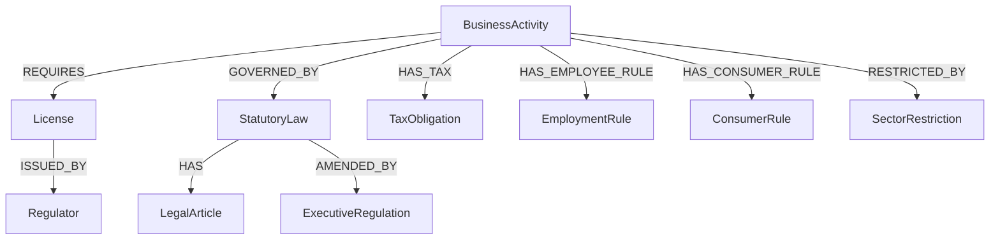

# Legal & Regulatory Knowledge Graph (GraphRAG)
## هستی‌شناسی و گراف ارتباطات رگولاتوری و حقوقی کسب‌وکار

در GraphRAG حقوقی، موجودیت‌های کسب‌وکار به صورت خوشه‌ای با قوانین، رگولاتورها، مجوزها و الزامات پیوند می‌خورند:



### نمونه پیمایش چندمرحله‌ای: فروشگاه آنلاین لوازم آرایشی (Online Cosmetics Store)
```
[Business: OnlineCosmeticsStore]
  ├── (GOVERNED_BY) ──> [Law: ElectronicCommerceLaw] ──(HAS)──> [Article: Art_37_Withdrawal_Right]
  ├── (GOVERNED_BY) ──> [Law: TradeUnionLaw] ──(REQUIRES)──> [License: Virtual_Trade_Union_Permit]
  ├── (SELLS) ──> [Product: CosmeticItem]
  │     ├── (REGULATED_BY) ──> [Regulator: Food_And_Drug_Administration_FDA]
  │     ├── (MANDATES) ──> [Compliance: Technical_Manager_Certificate]
  │     └── (TRACKED_BY) ──> [System: TTAC_Authenticity_Barcode]
  ├── (PAYMENT) ──> [System: Internet_Payment_Gateway]
  │     ├── (REGULATED_BY) ──> [Regulator: Central_Bank_CBI & Shaparak]
  │     └── (PREREQUISITE) ──> [License: Enamad_E_Trust_Symbol]
  ├── (TAX) ──> [Law: POS_Terminals_And_Taxpayer_System]
  │     └── (MANDATES) ──> [Obligation: Electronic_Invoicing_System]
  └── (ADVERTISING) ──> [Law: Ban_On_Health_Damaging_Ads]
        └── (RESTRICTS) ──> [Action: False_Therapeutic_Claims]
```

### نمونه پیمایش چندمرحله‌ای: شرکت نرم‌افزاری ابری (SaaS Company)
```
[Business: SaaS_Company]
  ├── (LEGAL_ENTITY) ──> [Type: Private_Joint_Stock_Company]
  ├── (REGULATED_BY) ──> [Regulator: Iranian_ICT_Guild_Organization_Nasr]
  ├── (PROTECTED_BY) ──> [Law: Computer_Software_Copyright_Act]
  │     └── (REGISTERS) ──> [Asset: Proprietary_Source_Code_Deposit]
  ├── (TAX) ──> [Law: Direct_Taxes_Act]
  │     └── (QUALIFIES_FOR) ──> [Exemption: Knowledge_Based_Daneshbonyan_Tax_Break]
  └── (DATA_GOVERNANCE) ──> [Law: Cyber_Crimes_Act]
        └── (MANDATES) ──> [Security: User_Data_Privacy_And_Encryption]
```

[[framework-three-knowledge-planes]]
[[framework-business-models-iran-compliance]]
